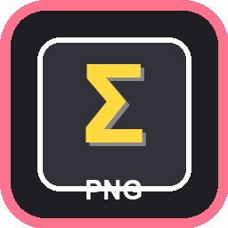
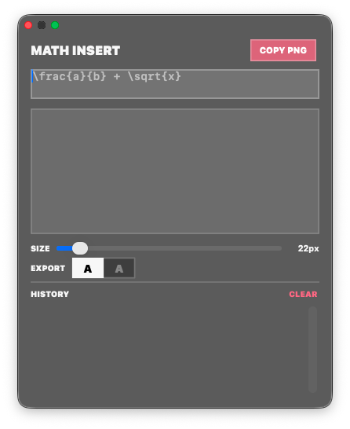

<p align="center">
  
</p>

<h1 align="center">MathInsert</h1>

<p align="center">
  <strong>Type LaTeX. Copy PNG. Paste anywhere.</strong>
</p>

<p align="center">
  <a href="https://github.com/knhn1004/math-insert-png/actions/workflows/ci.yml"></a>
  
  
  
  
  <a href="LICENSE"></a>
</p>

---

A lightweight macOS menu bar app that renders LaTeX math expressions and copies them as transparent PNGs to your clipboard. Paste into Keynote, Figma, Notion, Google Slides, or anywhere else that accepts images.

## Features

- **Live preview** -- see your expression rendered as you type
- **One-click copy** -- transparent PNG on your clipboard instantly
- **Global hotkey** -- `Ctrl+Shift+M` opens the panel from anywhere
- **Black or white export** -- toggle stroke color for light/dark backgrounds
- **Adjustable size** -- 16px to 96px render scale
- **Expression history** -- last 50 expressions saved and searchable
- **Neobrutalist UI** -- translucent dark panel with bold accents

## Screenshot

<p align="center">
  
</p>

## Install

### From Releases

Download the latest `.zip` from [Releases](https://github.com/knhn1004/math-insert-png/releases), unzip, and drag `MathInsert.app` to your Applications folder.

### Build from Source

```bash
git clone https://github.com/knhn1004/math-insert-png.git
cd math-insert-png
make build
make run
```

Requires **Xcode 14+** and **macOS 12+**.

## Usage

1. Click the **Sigma** icon in the menu bar
2. Select **Show Panel** (or press `Ctrl+Shift+M`)
3. Type a LaTeX expression
4. Adjust size and export color as needed
5. Click **COPY PNG** (or `Cmd+C`)
6. Paste into any app

## Development

```bash
make help          # show all commands
make build         # debug build
make test          # run unit tests
make release       # release build
make archive       # create .xcarchive
make icons         # regenerate app icons
make clean         # remove build artifacts
```

## Testing

```bash
make test
```

**13 tests** across 3 test suites:

| Suite | Tests | Coverage |
|-------|-------|----------|
| `MathExpressionTests` | 4 | init, unique IDs, Codable roundtrip |
| `HistoryManagerTests` | 8 | add, dedup, cap, remove, clear |
| `PNGExporterTests` | 1 | clipboard write/read |

## Project Structure

```
MathInsert/
  App/              AppDelegate, main
  Views/            StatusBarController, MainPopoverViewController, FloatingPanelController
  Rendering/        MathWebView (KaTeX), PNGExporter
  Models/           MathExpression, HistoryManager
  Resources/        math_render.html
  Assets.xcassets/  App icon
MathInsertTests/    Unit tests
scripts/            Icon generation
.github/workflows/  CI + Release automation
```

## License

[MIT](LICENSE)
